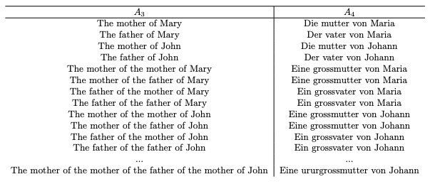

# Arbol ancestral

Build a compiler to translate ancestral terms. Use ancestral language A1 = {mother, father, grandmother, grandfather, greatgrandmother, greatgrandfather, greatgreatgrandmother, ..., greatgreatgreatgreat- greatgrandfather, ...} and build a grammar that reproduces it.
Also translate the expressions of entry into the number of generations that exist between the ancestors and the person. I.e. mother and father: 1. generation, grandmother and grandfather: 2. generation, greatgrandmother and great- grandfather: 3. generation, etc.

## Installation

For the correct usage install yacc and lex

### For mac

```
brew install byacc
```

and

```
brew install flex
```

### For linux

```
sudo apt-get install bison flex
```

## The project

### The project need to implement:

1. Gramatic construction
2. Parser development
3. Build a medium representation of the expressions
4. Implement attribs of the parser who helps in translate
5. Develpment the outputs



## Usage

Run this project with

First 
```
flex expression.l engine.y
```
then
```
bison -d engine.y
```
then
```
flex expression.l
```
then
```
c++ -c main.cpp engine.tab.c lex.yy.c
```
then if you're in linux
```
c++ main.o engine.tab.o lex.yy.o -o main -lfl
```
if youre in MacOs
```
c++ main.o engine.tab.o lex.yy.o -o main -ll
```

## Authors

- Antonio Toche
- Juan Vargas
- Herless Alvarado

## Contributions

For contributions only pull a new resquest

## License

The MIT License

Copyright (c) 2010-2019 Google

Permission is hereby granted, free of charge, to any person obtaining a copy
of this software and associated documentation files (the "Software"), to deal
in the Software without restriction, including without limitation the rights
to use, copy, modify, merge, publish, distribute, sublicense, and/or sell
copies of the Software, and to permit persons to whom the Software is
furnished to do so, subject to the following conditions:

The above copyright notice and this permission notice shall be included in
all copies or substantial portions of the Software.

THE SOFTWARE IS PROVIDED "AS IS", WITHOUT WARRANTY OF ANY KIND, EXPRESS OR
IMPLIED, INCLUDING BUT NOT LIMITED TO THE WARRANTIES OF MERCHANTABILITY,
FITNESS FOR A PARTICULAR PURPOSE AND NONINFRINGEMENT. IN NO EVENT SHALL THE
AUTHORS OR COPYRIGHT HOLDERS BE LIABLE FOR ANY CLAIM, DAMAGES OR OTHER
LIABILITY, WHETHER IN AN ACTION OF CONTRACT, TORT OR OTHERWISE, ARISING FROM,
OUT OF OR IN CONNECTION WITH THE SOFTWARE OR THE USE OR OTHER DEALINGS IN
THE SOFTWARE.
